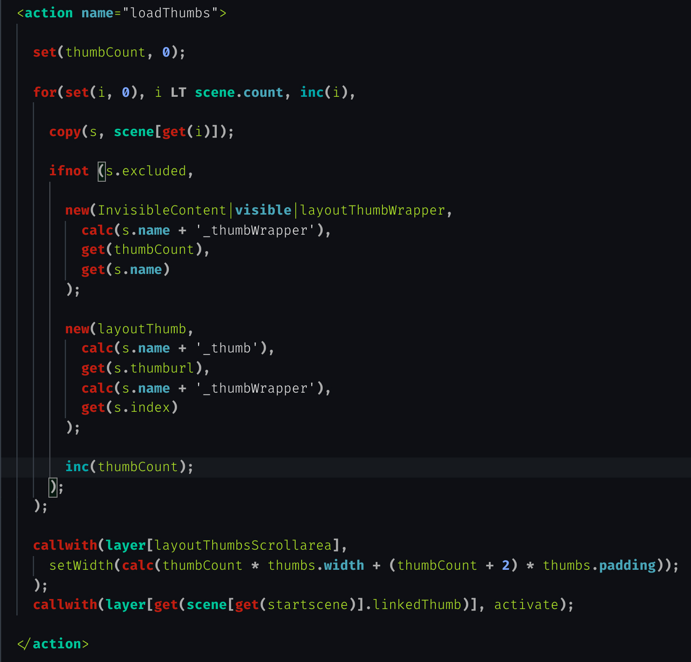

# Krpano Markup Language for Visual Studo Code

Syntax highlighting, autocompletions and snippets for [Krpano](https://krpano.com/) internal language.
Krpano is 360º panorama viewer offering UI development tools.

## Installation

1. Navigate to the VS Code extensions folder.

Windows: %USERPROFILE%\.vscode\extensions
macOS/Linux: $HOME/.vscode/extensions

2. Clone this project

``git clone https://github.com/apushkarev/krpano-for-vscode.git``
